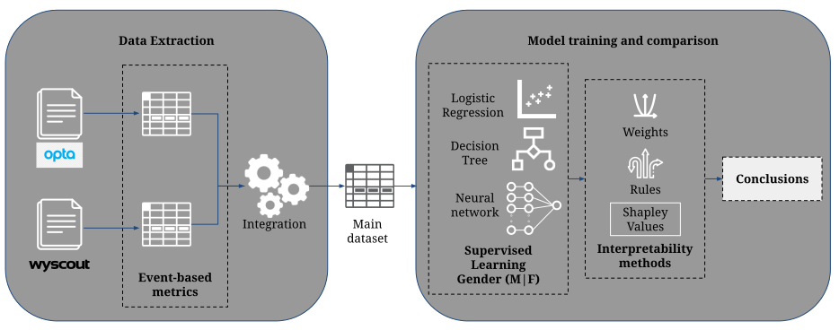

# Understanding gender differences in professional European football through Machine Learning interpretability and match actions data.
This repository contains the completed version of codes for the paper ["Understanding gender differences in professional European football through Machine Learning interpretability and match actions data"]() by [Marc Garnica Caparrós](https://marcgarnica13.github.io/me/) and [Daniel Memmert](https://fis.dshs-koeln.de/portal/en/persons/daniel-memmert(da681bc9-cc2c-4cea-8243-a578469e5577).html).
## Installation

Install the required python packages
```
pip install -r requirements.txt
```

To handle heterogeneity and performance efficiently, we use PySpark from [Apache Spark](https://spark.apache.org/). PySpark enables an end-user API for Spark jobs. You might want to check how to set up a local or remote Spark cluster in [their documentation](https://spark.apache.org/docs/latest/api/python/index.html).

## Methodology

<p align="center"></p>

## Repository structure
This repository is organized as follows:

- Preprocessed data from the two different data streams is collecting in [the data folder](data/). For the Opta files, it contains the event-based metrics computed from each match of the 2017 Women's Championship and a single file calculating the event-based metrics from the 2016 Men's Championship published [here](https://figshare.com/collections/Soccer_match_event_dataset/4415000/5).
Even though we cannot publish the original data source, the two python scripts implemented to homogenize and integrate both data streams into event-based metrics are included in [the data gathering folder](data_gathering/) folder contains the graphical images and media used for the report.
- The [data cleaning folder](data_cleaning/) contains descriptor scripts for both data streams and [the final integration](data_cleaning/merger.py)
- [Classification](classification/) contains all the Jupyter notebooks for each model present in the experiment as well as some persistent models for testing.

## References
```
@article{garnicacaparros2021gender,
title={Understanding gender differences in professional European football through Machine Learning interpretability and match actions data},
author={Garnica-Caparrós, Marc and Memmert, Daniel},
journal={Scientific reports},
publisher={Nature Publishing Group}
}
```
This paper can be accessed on : ["Understanding gender differences in professional European football through Machine Learning interpretability and match actions data"]().


## Contact
Please email to [m.garnica@dshs-koeln.de](mailto:m.garnica@dshs-koeln.de) should you have any questions, comments or suggestions.